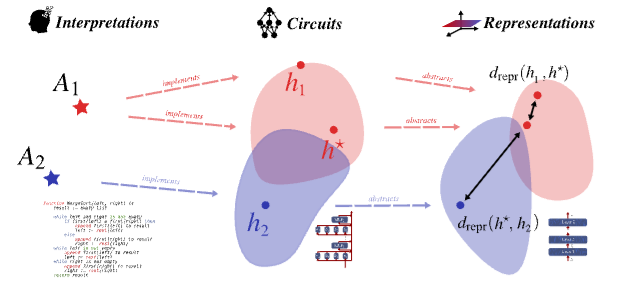

# Tracking Equivalent Mechanistic Interpretations Across Neural Networks



This repository contains code that creates Figure 2 of [Tracking Equivalent Mechanistic
Interpretations Across Neural Networks](https://arxiv.org/pdf/2603.30002). 

There are three experiments:
1. Verifying the efficacy of interpretive equivalence on a toy task (n-permutation detection). This is contained in `left/`. Note that we build off [InterpBench](https://github.com/FlyingPumba/InterpBench/blob/main/README.md).
2. Measure interpretive equivalence across pre-trained language models on a naturalistic task (indirect-object identification). This is contained in `center/`.
3. Apply interpretive equivalence to next-token prediction. We show that certain next-token predictions in GPT-2 are interpretively equivalent to parts-of-speech identification. This is contained in `right/`. 

If you use this code in your research please cite:
```tex
@inproceedings{
    sun2026provably,
    title={Provably Tracking Equivalent Mechanistic Interpretations Across Neural Networks},
    author={Alan Sun and Mariya Toneva},
    booktitle={The Fourteenth International Conference on Learning Representations},
    year={2026},
    url={https://openreview.net/forum?id=9lycwRxAOI}
}
```
